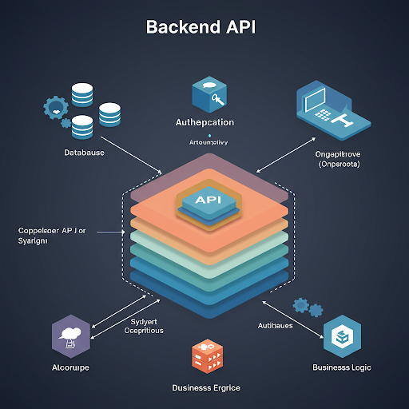
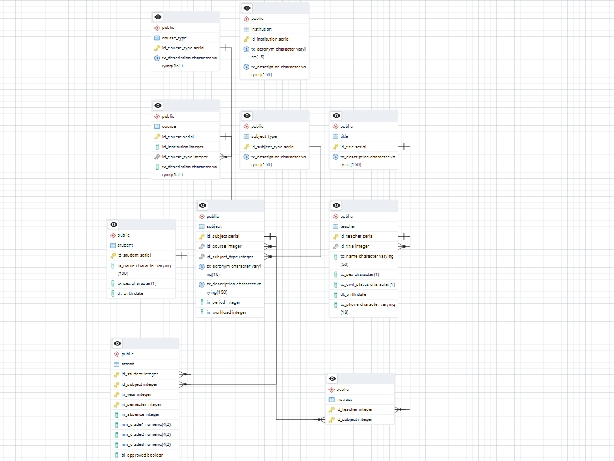
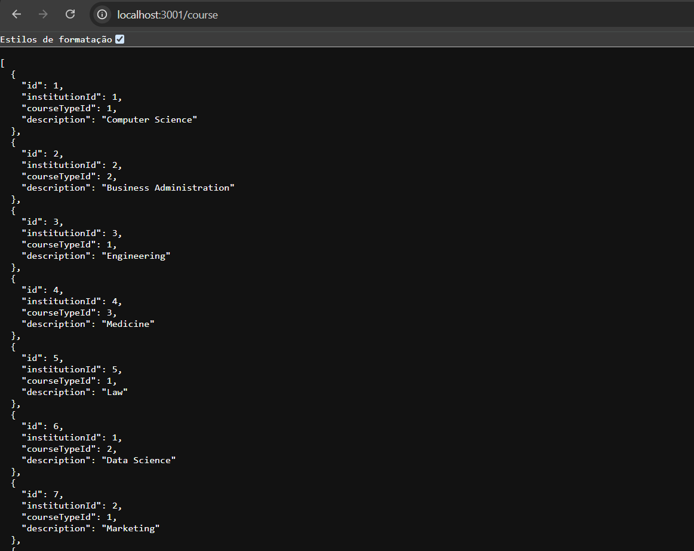

# College API

<div align="center">



<div data-badges>
 
 
 
 

</div>

<div data-badges>
 
 
 
 
</div>

</div>

A college_api é uma aplicação backend construída com o framework NestJS, projetada para servir como uma API (Interface de Programação de Aplicações) robusta e eficiente. Seu principal objetivo é disponibilizar dados de um banco de dados relacional, abrangendo informações cruciais para o ambiente acadêmico, como:

- Professores: Detalhes sobre os docentes, incluindo informações de contato, áreas de especialização e histórico acadêmico.
- Matérias: Informações sobre as disciplinas oferecidas, como ementa, pré-requisitos e carga horária.
- Títulos: Dados sobre os títulos acadêmicos dos professores e a titulação dos cursos oferecidos.
- Cursos: Informações sobre os cursos disponíveis, incluindo grade curricular, duração e requisitos de admissão.
- Alunos: Dados sobre os estudantes, como informações de contato, histórico escolar e status de matrícula.

## Características da Aplicação:

- Arquitetura NestJS: A aplicação foi desenvolvida utilizando o framework NestJS, conhecido por sua arquitetura modular e escalável. Isso garante uma estrutura organizada e de fácil manutenção, facilitando a adição de novas funcionalidades e a otimização do desempenho.
- Banco de Dados Relacional: A aplicação se conecta a um banco de dados relacional, como PostgreSQL ou MySQL, para armazenar e recuperar os dados de forma eficiente. O uso de um banco de dados relacional garante a integridade e a consistência dos dados, além de permitir consultas complexas e relacionamentos entre as tabelas.

## Objetivo da Aplicação:

A college_api foi desenvolvida como requisito para a disciplina de Programação III, com o objetivo de demonstrar os conhecimentos adquiridos em desenvolvimento de aplicações backend com NestJS e APIs RESTful. A aplicação serve como um exemplo prático de como construir uma API para disponibilizar dados de um banco de dados relacional, atendendo às necessidades de um sistema de gerenciamento acadêmico.

## Como rodar esse projeto

### Requisitos

- Node.js instalado

### Execução

1. Clone esse repositório

    ```sh
    git clone https://github.com/Pablo-Sts/college_api
    ```

2. Acesse o diretório do projeto: 

    ```sh
    cd college_api
    ```

3. Criar um banco de dados de acordo com o ERD abaixo:
  

4. Copie as variáveis de ambiente listads e crie um arquivo `.env` e preencha com as seguintes informações:

    ```sh
      DB_HOST = 
      DB_PORT = 
      DB_USER = 
      DB_PASSWORD = 
      DB_NAME =
    ```

5. Instale as dependênciads do projeto com o comando `npm i`.

6. Abra um terminal na pasta do projeto e execute o comando `npm start` para executar o projeto.

## Preview



## Links úteis

- [NestJS](https://nestjs.com/)
- [TypeORM](https://typeorm.io/)
- [PostgreSQL](https://www.postgresql.org/)